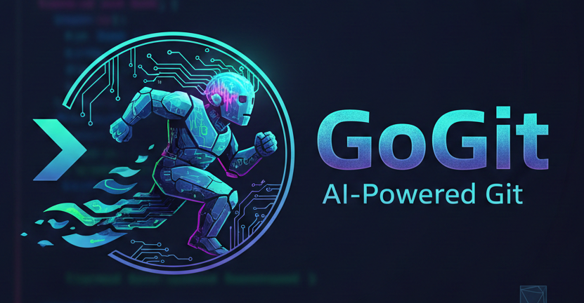
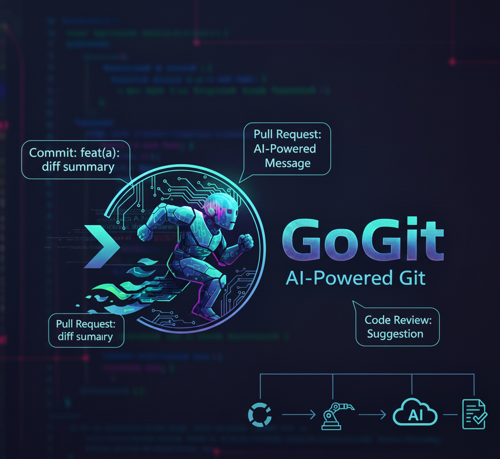

<p align="center">
  
</p>

# gogit CLI

<p align="center">
  
</p>

gogit is a command-line interface tool that integrates AI capabilities into your Git workflow, enhancing productivity and code quality. It leverages AI to generate commit messages, draft pull request descriptions, review code for potential issues, refactor code, and semantically search your Git history.

## ✨ Key Features

- **✨ AI Commit**: Generate and commit smart, descriptive commit messages automatically.
- **🚀 AI Pull Request**: Create detailed PR descriptions with summaries and key changes.
- **🕵️ AI Code Review**: Receive architectural and security-focused feedback on your changes.
- **🛠️ AI Fix**: Precision AI refactoring and bug fixing based on your instructions.
- **🔍 AI Search**: Semantic search through your git history using natural language.
- **📑 AI Documentation**: Automatically generate and update your project README.
- **⚔️ AI Conflict Resolution**: Let AI help you resolve complex merge conflicts intelligently.
- **🌱 AI Smart Branch**: Create new branches with contextually relevant, AI-suggested names.
- **🏷️ AI NL Alias**: Translate English requests into powerful Git commands/aliases.
- **👥 Team Power-Ups**: Generate professional release notes, navigate the repository, and analyze stale branches.

## Installation

1. **Prerequisites:**

   - Rust toolchain (Cargo) installed.
   - Git installed and configured.
   - An API key for Gemini. Set `GEMINI_API_KEY` in your environment or `.env` file.

2. **Installation:**
   The recommended way to install `gogit` is using our installer script:

   ```bash
   chmod +x install.sh
   ./install.sh
   ```

   This builds the binary in release mode and installs it to `~/.local/bin/`.

3. **Manual Build:**
   Alternatively, you can build it manually:

   ```bash
   cargo build --release
   cp target/release/gogit ~/.local/bin/
   ```

4. **Install Git Hooks:**
   ```bash
   gogit hook install
   ```

## Usage

The `gogit` CLI offers several commands to integrate AI into your Git workflow.

### 1. Commit Generation

Automatically generate a commit message for your staged changes.

# Generate AI commit message for staged changes

gogit commit

### 2. Pull Request Description Generation

Generate a description for your pull request.

# Generate AI PR description for the current branch based on its diff with the base branch

gogit pr

### 3. Code Review

Get an AI-powered review of your staged code.

# Review staged changes for bugs and security issues

gogit review

### 4. Refactoring

Use AI to refactor a specific file based on an instruction.

# Refactor the 'src/main.rs' file to improve error handling

gogit fix src/main.rs "Improve error handling by using Result and ? operator"

# Refactor the 'utils.py' file to add type hints

gogit fix utils.py "Add type hints to all function signatures"

### 5. Git History Search

Perform a semantic search across your Git history using natural language.

# Find commits related to user authentication changes

gogit search "user authentication"

# Search for commits that involved performance optimizations

gogit search "performance improvements"

### 6. AI Conflict Resolution

Check if merging your current branch into a base branch would result in any conflicts, and optionally let AI resolve them for you.

# Check for conflicts against the 'main' branch

gogit check --base main

# If conflicts are found, gogit will offer to resolve them using AI.

### 7. Smart Branching

Create a new branch with an AI-suggested name based on your task.

# Describe your task to create a branch

gogit branch "fix the navigation bar bug on mobile"

### 8. Natural Language Aliases

Translate your Git requests into commands and optionally save them.

# Get a command for a specific need

gogit alias "list all files changed in the last 2 days"

### 9. AI Release Notes

Generate professional release notes since your last tag.

# Automatically analyze commits since last tag and save to RELEASE_NOTES.md

gogit release

### 10. AI Repo Navigator (Explain)

Get answers to your questions about the codebase.

# Ask about the architecture or where a feature is implemented

gogit explain "How is the encryption handled in the backend?"

### 11. Smart Stale Branch Analysis

Intelligently identify redundant branches that are safe to delete.

# Analyze branches relative to main

gogit stale

### 12. Documentation Management

Manage your project's documentation, including updating the README or generating doc-comments.

# Update README.md (Interactive: uses staged changes or prompts for full scan)

gogit doc

### 7. Git Hook Management

Install or uninstall Git hooks for automated workflows.

# Install the necessary Git hooks

gogit hook install

# Uninstall the Git hooks

gogit hook uninstall

---

**Configuration:**

`gogit` is configured via a `config.toml` file located in `~/.config/gogit/config.toml`.

Example `config.toml`:

```toml
model = "gemini-2.5-flash-lite" # Or your preferred model
commit_prompt = "Generate a concise commit message summarizing these changes."
pr_prompt = "Create a detailed PR description highlighting the problem, solution, and any potential impacts."
```
